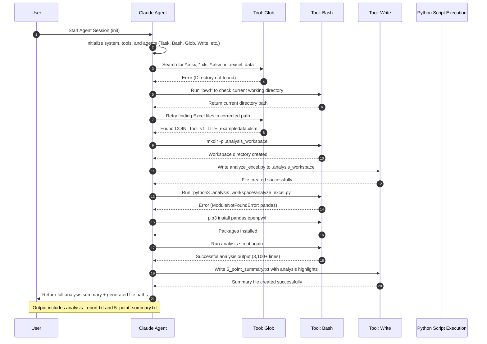
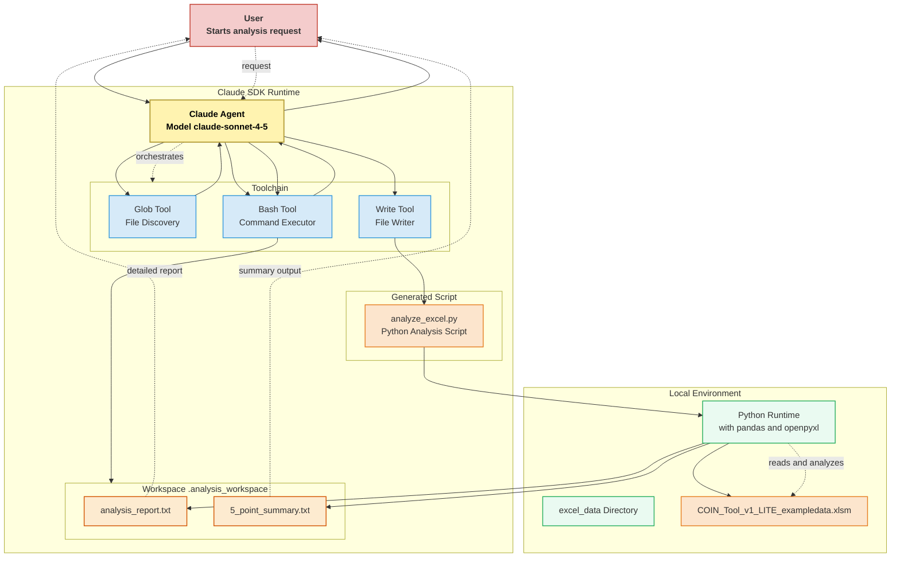

# Sample workflow of excel analyser using Claude code Agent SDK

## Sequence diagram

```mermaid
sequenceDiagram
    autonumber
    participant U as User
    participant A as Claude Agent
    participant Glob as Tool: Glob
    participant Bash as Tool: Bash
    participant Write as Tool: Write
    participant Python as Python Script Execution

    %% --- Initialization ---
    U->>A: Start Agent Session (init)
    A->>A: Initialize system, tools, and agents (Task, Bash, Glob, Write, etc.)

    %% --- Step 1: Find Excel files ---
    A->>Glob: Search for *.xlsx, *.xls, *.xlsm in ./excel_data
    Glob-->>A: Error (Directory not found)

    %% --- Step 2: Diagnose directory issue ---
    A->>Bash: Run "pwd" to check current working directory
    Bash-->>A: Return current directory path
    A->>Glob: Retry finding Excel files in corrected path
    Glob-->>A: Found COIN_Tool_v1_LITE_exampledata.xlsm

    %% --- Step 3: Prepare analysis environment ---
    A->>Bash: mkdir -p .analysis_workspace
    Bash-->>A: Workspace directory created

    %% --- Step 4: Create Python analysis script ---
    A->>Write: Write analyze_excel.py to .analysis_workspace
    Write-->>A: File created successfully

    %% --- Step 5: Execute analysis script ---
    A->>Bash: Run "python3 .analysis_workspace/analyze_excel.py"
    Bash-->>A: Error (ModuleNotFoundError: pandas)

    %% --- Step 6: Install dependencies ---
    A->>Bash: pip3 install pandas openpyxl
    Bash-->>A: Packages installed

    %% --- Step 7: Re-run analysis ---
    A->>Bash: Run analysis script again
    Bash-->>A: Successful analysis output (3,100+ lines)

    %% --- Step 8: Create summary report ---
    A->>Write: Write 5_point_summary.txt with analysis highlights
    Write-->>A: Summary file created successfully

    %% --- Step 9: Final output ---
    A-->>U: Return full analysis summary + generated file paths
    Note over A,U: Output includes analysis_report.txt and 5_point_summary.txt
```

## Architecture workflow 

```mermaid
flowchart TD
    %% ====== STYLING ======
    classDef agent fill:#fff3b0,stroke:#b59f3b,stroke-width:2px,color:#000,font-weight:bold
    classDef tool fill:#d6eaf8,stroke:#3498db,stroke-width:1.5px
    classDef env fill:#eafaf1,stroke:#27ae60,stroke-width:1.5px
    classDef file fill:#fce5cd,stroke:#e67e22,stroke-width:1.5px
    classDef output fill:#fdebd0,stroke:#d35400,stroke-width:1.5px
    classDef user fill:#f4cccc,stroke:#c0392b,stroke-width:1.5px,font-weight:bold

    %% ====== NODES ======
    U[User\nStarts analysis request]:::user

    subgraph R[Claude SDK Runtime]
        A[Claude Agent\nModel claude-sonnet-4-5]:::agent

        subgraph T[Toolchain]
            T1[Glob Tool\nFile Discovery]:::tool
            T2[Bash Tool\nCommand Executor]:::tool
            T3[Write Tool\nFile Writer]:::tool
        end

        subgraph S[Generated Script]
            PY[analyze_excel.py\nPython Analysis Script]:::file
        end

        subgraph W[Workspace .analysis_workspace]
            O1[analysis_report.txt]:::output
            O2[5_point_summary.txt]:::output
        end
    end

    subgraph L[Local Environment]
        D[excel_data Directory]:::env
        X[COIN_Tool_v1_LITE_exampledata.xlsm]:::file
        P[Python Runtime\nwith pandas and openpyxl]:::env
    end

    %% ====== CONNECTIONS ======
    U --> A
    A --> T1
    T1 --> A

    A --> T2
    T2 --> A

    A --> T3
    T3 --> PY
    PY --> P

    A --> T2
    T2 --> W

    P --> X
    P --> O1
    P --> O2

    A --> U

    %% ====== LABELS ======
    U -. request .-> A
    A -. orchestrates .-> T
    P -. reads and analyzes .-> X
    O1 -. detailed report .-> U
    O2 -. summary output .-> U

```